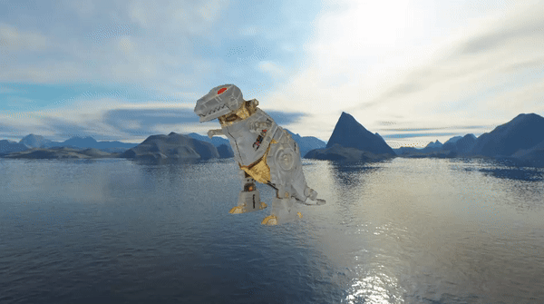

# Combined movements 

- Zoom in and out
- Up and down
- Orbit

# Individual movements

## Movement around model

- A key -> left 
- D key-> right

## Zoom Out + Zoom In (with limits)

- W key -> Zoom In
- S key-> Zoom Out

## Up and Down

- K_UP key -> model up
- K_DOWN key -> model down

