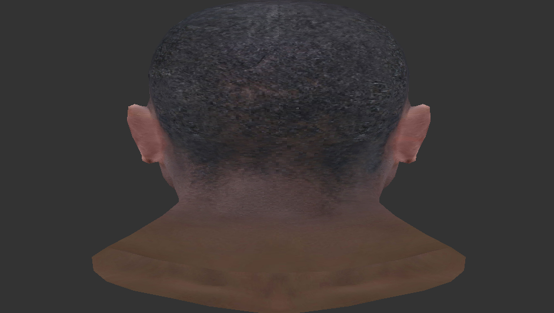
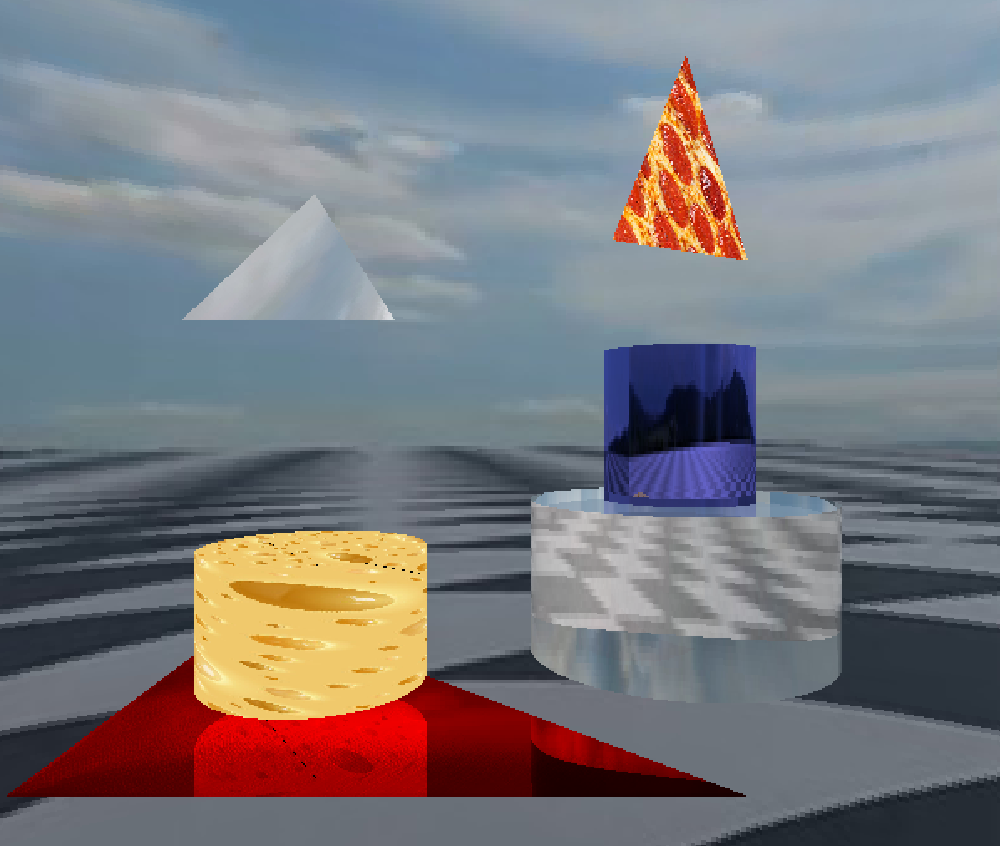

# Shader Effects Application

This application showcases various shader effects applied to 3D models using OpenGL and Python. Experience dynamic visual transformations like the orange, rainbow, and grayscale shaders.

## Demo

*Click the image above to watch the demo on YouTube.*

## Features

- **Orange Shader with Bouncing Movement:**
  - Applies an orange color with shading that highlights the model's curves.
  - Features a bouncing movement effect using an ease-out easing function.

- **Rainbow Shader with Rotation:**
  - Displays dynamic rainbow colors that change over time.
  - Includes a gentle rotation effect to showcase the model from different angles.

- **Grayscale Shader with Water-like Movement:**
  - Converts the model's textures to grayscale.
  - Adds a water-like waving movement to simulate fluid motion.

## Model + camera + perspective

## Model rotation

## Model with texture

## Model

### Triangle
