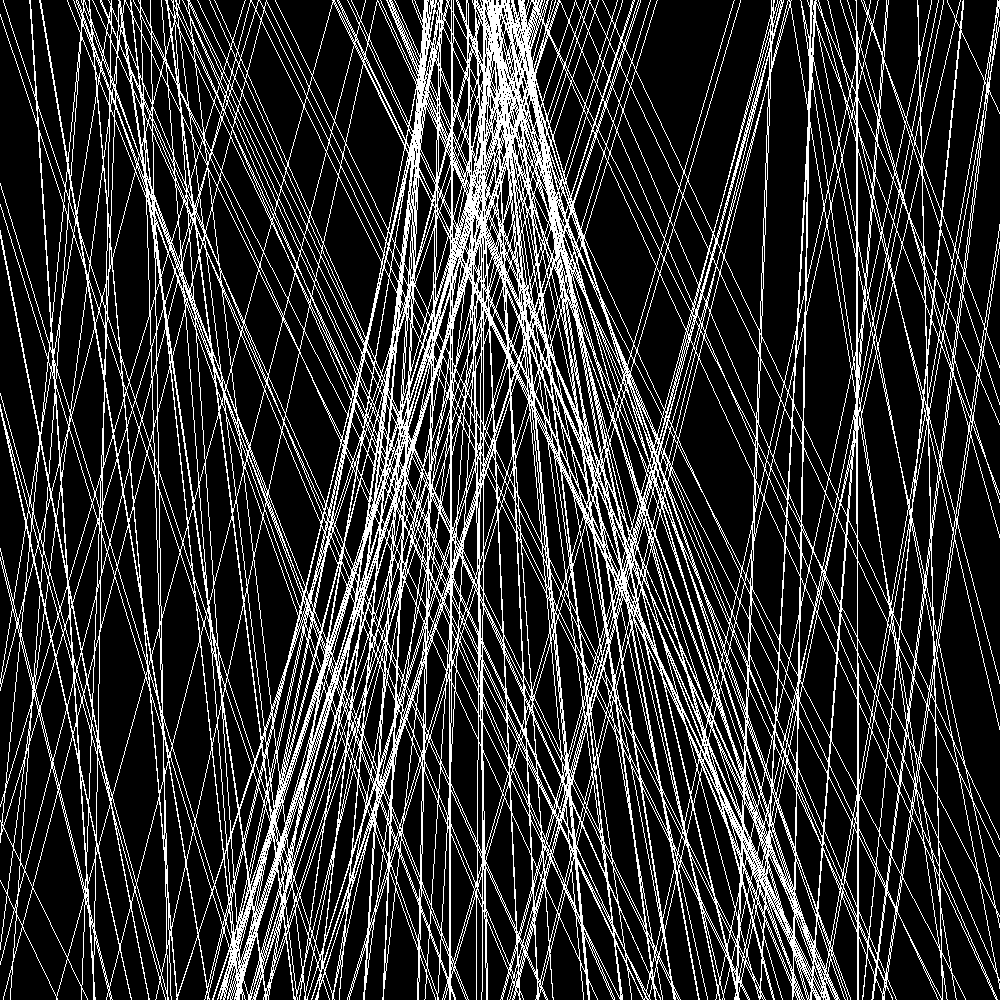
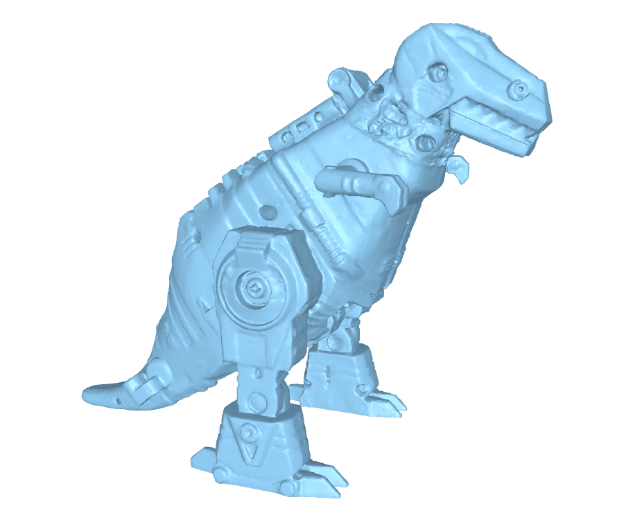
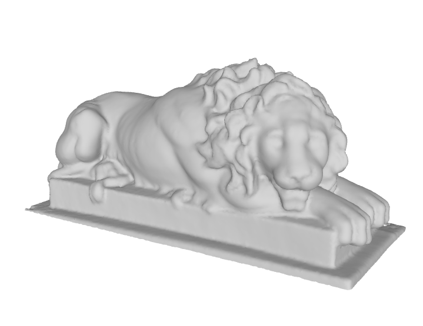
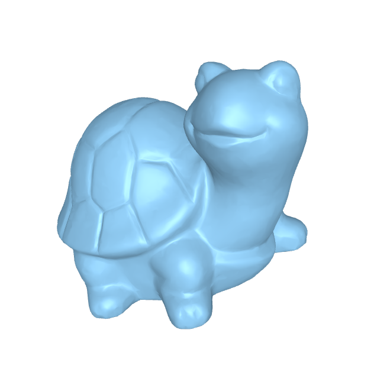
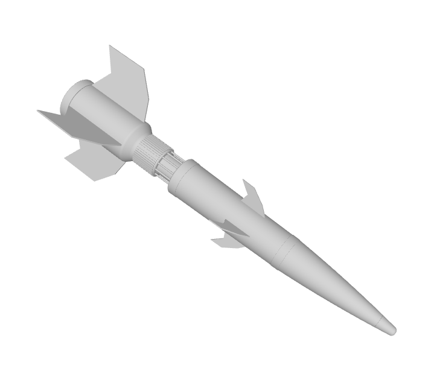

# 3D Model Scene Overview

This scene represents an action-packed moment where a dinosaur is being attacked by a rocket in a garden that features classic elements such as a Greek lion sculpture and a traditional turtle statue. Each model in the scene is rendered using different shaders to enhance their appearance and provide a unique visual experience.

## Models and Shaders

| Model                | Shader              | Triangles | Vertices | Image                          |
|----------------------|---------------------|-----------|----------|--------------------------------|
| dino.obj             | Blue Gray Shader    | 115,124   | 57,558   |         |
| LionSculpture.obj    | Vintage Yellow Shader | 75,901    | 38,482   |        |
| tartaruga.obj        | Wood Shader         | 20,008    | 10,006   |    |
| rocket.obj           | Missile Shader      | 18,257    | 9,202    |    |
