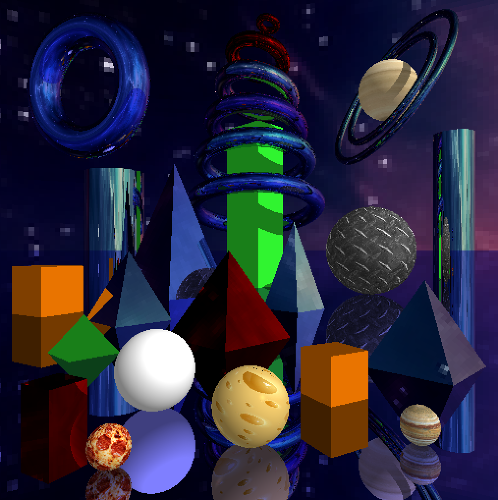

# 🚀 Futuristic Space City Ray Tracing Scene 🌌

Welcome to the **Futuristic Space City** ray tracing project! This project features a rich and dynamic 3D scene simulating a futuristic cityscape set in outer space. The scene is rendered using ray tracing techniques to achieve realistic lighting, shadows, reflections, and refractions.

## 🖼️ Scene Overview

The scene includes a total of **26 figures** composed of various geometric shapes, materials, and textures to create a visually stunning and immersive environment.

### 🔷 9 Rotated Toroids

- **Description**: Representing futuristic architecture and space structures.
- **Details**:
  - Each toroid (torus) is uniquely rotated on different axes.
  - Reflective materials to simulate metallic surfaces.
  - Positioned strategically to create depth and complexity.

  ### 🌐 6 Spheres

- **Description**: Symbolizing planets, and futuristic domes.
- **Details**:
  - Varied sizes and materials (opaque, reflective, transparent).
  - Some spheres have textures to represent planetary surfaces.

### 🧊 3 Customizable Rotated Boxes/Cubes

- **Description**: Serving as buildings or space stations.
- **Details**:
  - Each cube is rotated and can be customized with different textures.
  - Sizes vary to add variety to the cityscape.

### 🔺 6 Pyramids

- **Description**: Adding an ancient yet futuristic touch.
- **Details**:
  - Pyramids are of different sizes and orientations.
  - Materials range from reflective metals to textured stones.
  - Positioned to create symmetry and balance.

### 🛢️ 2 Cylinders

- **Description**: Representing towers or conduits.
- **Details**:
  - Tall and sleek design to mimic futuristic towers.
  - Metallic materials with reflective properties.

## 🛠️ Technologies Used

- **Python**: Core programming language for the project.
- **Pygame**: Used for display and rendering.
- **Ray Tracing Algorithms**: Custom implementations for rendering the scene.

## ⏳ Rendering Time and Development Process

This scene took **1 hour** to render at a resolution of **1080 x 1080** pixels. Below is a series of snapshots showcasing the scene being built from scratch, illustrating the step-by-step creation of this intricate and immersive environment.

# 📸 Scene Development Progression
## 🖼️🚀 Final Scene

## Almost completed

## Placing a tower of toroids

## Placed spheres

## Introducing boxes to the scene

## Cylinders, tours, pyramides

## Torus + 3 pyramids

## testing a pyramid

## testing a torus
